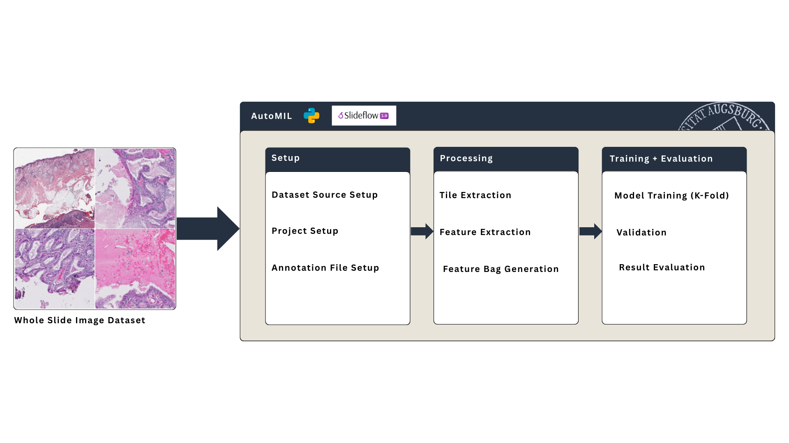

# AutoMIL 
## Automated Machine Learning for Image Classification in Whole-Slide Imaging with Multiple Instance Learning

AutoMIL provides a flexible framework for training and evaluating Multiple Instance Learning models for the task of image classification on Whole Slide Image (WSI) datasets.



## Features

- **Automated Pipeline**: Complete automated workflow encompassing preprocessing, training and evalutuation
- **Image Backend Compatibility**: Support for multiple common image backends (cucim, libvips, openslide) available on both Linux and Windows
- **Memory Optimization**: Automated adjustments of hyperparamters to better adaptat to available VRAM
- **Rich Logging**: Extensive logging and debug functionality with color-coding using [Rich](https://rich.readthedocs.io/en/stable/introduction.html)
- **Configuration**: Support for various slide formats and annotation strucutures

## Installation

### Requirements
- Python 3.11+
- Cuda-compatible GPU
- libvips (Windows) or cucim (Linux)

### Setup

#### [pip](https://pypi.org/project/pip/)
```bash
git clone https://github.com/your-repo/AutoMIL.git
cd AutoMIL
pip install -r requirements.txt
```
#### [uv](https://docs.astral.sh/uv/)
```bash
git clone https://github.com/your-repo/AutoMIL.git
cd AutoMIL
uv sync
# Activate the virtual environment
source .venv/bin/activate  # Linux/macOS
# or
.venv\Scripts\activate     # Windows
```

## Quick Start

### Basic Pipeline
Run the complete AutoMIL training pipeline:

```bash
cd AutoMIL
source .venv/bin/activate
python3 src/cli.py run-pipeline ./slides ./annotations.csv ./project_dir --verbose
```

**Options:**
- `-pc, --patient_column`: Column name for patient IDs (default: "patient")
- `-lc, --label_column`: Column name for labels (default: "label")
- `-sc, --slide_column`: Column name for slide names (optional)
- `-k`: Number of cross-validation folds (default: 3)
- `-t, --transform_labels`: Transform labels to float values
- `-v, --verbose`: Enable detailed logging
- `-c, --cleanup`: Delete project structure after completion

### Batch Size Analysis
Analyze model performance across different batch sizes:

```bash
cd AutoMIL
source .venv/bin/activate
python3 src/cli.py batch-analysis ./slides ./annotations.csv ./project_dir --batch_sizes "2,4,8,16,32" --plot --verbose
```

**Options:**
- All options from `run-pipeline`
- `-bs, --batch_sizes`: Comma-separated batch sizes (default: "2,4,8,16,32")
- `-p, --plot`: Generate plots automatically after analysis

## Expected Dataset Structure

AutoMIL expects datasets to be organized in a specific structure depending on the type of dataset being used (WSI dataset or pretiled image dataset).

### Whole Slide Image Dataset (Default)

When working with WSI's, provide the following paths to the `run-pipeline` or `batch-analysis` commands:

- **Slides Directory:** A directory containing all WSI files (e.g., `.svs`, `.tiff`, etc.) | CLI Argument: **SLIDES_DIR** \
**NOTE**: If slides come in the .png format, a preprocessing step is performed to convert them to .tiff files for compatibility.

- **Annotations File:** a .csv containing associated patient and slide IDs along with their labels | CLI Argument: **ANNOTATIONS_FILE** \
    At minimum, the .csv file should contain the following columns:
    - Patient ID column (default name: "patient", configurable via `-pc, --patient_column`)
    - Label column (default name: "label", configurable via `-lc, --label_column`)
    A minimal annotations file could look like this:
    ```
    patient,label
    P001,0
    P002,1
    P003,0
    P004,1
    ```

- **Project Directory:** A directory where any intermediate files and results will be stored | CLI Argument: **PROJECT_DIR** \
The project directory will be created if it does not already exist.

### Pretiled Image Dataset

If you are working with a pretiled dataset, make sure that your **Slide Directory** is structured as follows:

- Each slide should have its own subdirectory within the main slides directory.
- Each subdirectory should contain the image tiles corresponding to that slide.
For example:
```
slides/
    slide_001/
        tile_001.png
        tile_002.png
        ...
    slide_002/
        tile_001.png
        tile_002.png
```