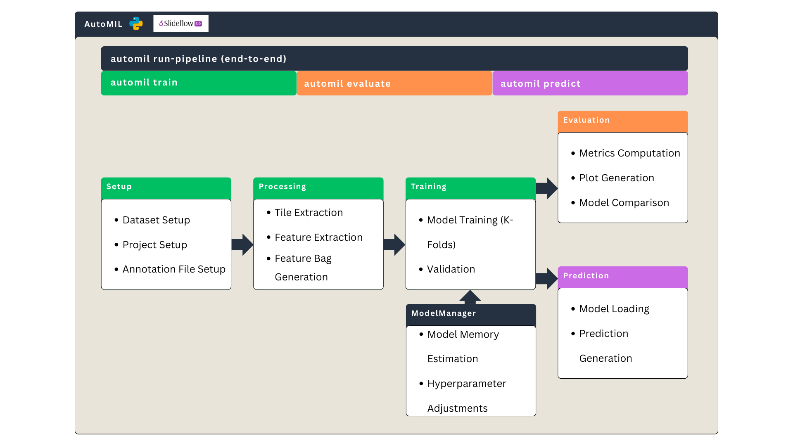
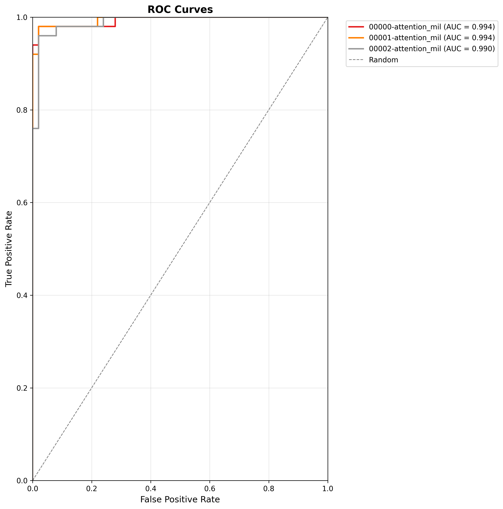

# AutoMIL

**Automated Machine Learning for Image Classification in Whole-Slide Imaging with Multiple Instance Learning.**

[](https://github.com/frankkramer-lab/AutoMIL/actions/workflows/ci.yaml)
[](https://github.com/astral-sh/ruff)
[](https://frankkramer-lab.github.io/AutoMIL/)
[](https://www.python.org/)
[](LICENSE.md)

AutoMIL is a flexible, open-source, end-to-end pipeline for training and evaluating Multiple Instance Learning (MIL) models for image classification on whole-slide images (WSIs).
It provides a modular command-line interface (CLI) that enables straightforward usage and adaptation to diverse WSI datasets.
In addition to the CLI, AutoMIL exposes a Python API for programmatic use, allowing users to build their own custom workflows.

```bash
automil run-pipeline ./slides ./annotations.csv ./project -v
```



**[Documentation](https://frankkramer-lab.github.io/AutoMIL/)** · **[Installation](https://frankkramer-lab.github.io/AutoMIL/getstarted/installation/)** · **[Quickstart](https://frankkramer-lab.github.io/AutoMIL/getstarted/quickstart/)**

## Features

- **End-to-end CLI:** The command `run-pipeline` covers everything from raw slides to an evaluation report. `train`, `evaluate` and `predict` run individual stages, while `create-split` handles dataset splitting.
- **Memory-aware batch sizing:** the largest batch size that fits the available GPU memory is found automatically (see [How it works](#how-it-works)).
- **Multiple MIL architectures:** [Attention-MIL](https://arxiv.org/abs/1802.04712), [TransMIL](https://arxiv.org/abs/2106.00908) and a Bistro transformer, selectable with `-m`.
- **Resolution presets:** tile size and magnification are chosen from named presets (`Ultra_Low` to `Ultra`) and models can be trained can be trained on several presets in one run.
- **Flexible input:** standard WSI formats (`.svs`, `.tiff`, OME-TIFF, …), PNG slides via automatic TIFF conversion, and pretiled datasets.
- **Evaluation and interpretability:** metrics, ROC curves, model comparison plots, ensemble predictions and attention heatmaps.
- **Python API:** every CLI stage is backed by a class (`Project`, `Dataset`, `Trainer`, `Evaluator`, …) for custom workflows.

## How it works

AutoMIL builds on [Slideflow](https://slideflow.dev/) for slide I/O and tile extraction, and on [fastai](https://github.com/fastai/fastai) for training. AutoMIL adds automation around these components, handling tasks such as resource-aware hyperparameter selection, feature extraction, and end-to-end pipeline management.

**1. Project and dataset setup.** Annotations are validated and normalised, so custom patient, slide and label column names are supported. The average Microns-Per-Pixel (MPP) is read from the slides, and each resolution preset is translated into a physical tile size in µm, which keeps tiling consistent across scanners.

**2. Slide backend selection.** Slideflow reads slides with cuCIM by default. AutoMIL checks the input and switches to libvips when it is needed (OME-TIFF files, or PNG slides that must be converted to TIFF).

**3. Feature bags.** Tiles are embedded with a pretrained pathology foundation model (CTransPath) and stored as one feature bag per slide.

**4. Resource-aware hyperparameters.** Choosing a batch size for MIL is awkward because each sample is a bag of hundreds to thousands of tiles. AutoMIL's `ResourceOptimizer`:

- instantiates the selected model and runs a real forward and backward pass on dummy bags of the dataset's average bag size, to measure peak GPU memory (`MemoryEstimator`);
- doubles the batch size until the measured peak exceeds 90% of free memory, then binary-searches the boundary;
- rejects candidates that break dataset or model constraints (a batch larger than the dataset, too few steps per epoch, model-specific limits) using a cheap feasibility check before any GPU work is done;
- caches measurements, so repeated probes are free.

Training runs with automatic mixed precision and early stopping. On CPU-only machines it falls back to safe defaults.

**5. Training and evaluation.** Models are trained with k-fold cross-validation. The `Evaluator` then computes Accuracy, AUC, AP and F1 per model and for the ensemble, and writes comparison plots and attention heatmaps.

<p align="center">
  
  <br>
  <em>Example of an evaluation plot generated by <code>automil evaluate</code> (quickstart demo run on a 100-slide TCGA lung subset).</em>
</p>

## Installation

**Requirements:** Linux, Python 3.11+ and a CUDA-capable GPU or CPU are required. AutoMIL depends on Slideflow and cuCIM, which are developed for Linux. libvips (`pip install .[vips]`) is optional and needed only for OME-TIFF or PNG input.

```bash
git clone https://github.com/frankkramer-lab/AutoMIL.git
cd AutoMIL
pip install .
```

See the [installation guide](https://frankkramer-lab.github.io/AutoMIL/getstarted/installation/) for details.

### Setup

**AutoMIL** can be installed directly from its public [GitHub](https://github.com/frankkramer-lab/AutoMIL) repository. To download the source code, open a terminal, navigate to any directory and run:

```bash
git clone https://github.com/frankkramer-lab/AutoMIL
```

This will clone the projects source code inside a new directory called `./automil`. Navigate to this directory and install **AutoMIL** in your current python environment:

```bash
pip install .
```

## Quickstart

A dataset is a directory of slides plus a CSV file with one label per slide:

```text
dataset/
├── slides/
│   ├── case_001.svs
│   ├── case_002.svs
│   └── case_003.svs
└── annotations.csv
```

```csv
patient,slide,label
001,case_001,0
002,case_002,0
003,case_003,1
```

Train (5-fold cross-validation, TransMIL):

```bash
automil train ./dataset/slides ./dataset/annotations.csv ./project -m TransMIL -k 5 -v
```

Evaluate the trained models:

```bash
automil evaluate ./dataset/slides ./dataset/annotations.csv ./project/bags ./project/models -o ./project/evaluation -v
```

Or do both in one step with `automil run-pipeline`. Run `automil <command> --help` for all options, including custom column names (`-pc`, `-lc`, `-sc`), multi-resolution runs (`-r "Low,High"`) and predefined train/test splits (`--split-file`).

The [quickstart guide](https://frankkramer-lab.github.io/AutoMIL/getstarted/quickstart/) walks through a full run on a public TCGA lung cancer subset.

## Project structure

```text
automil/
├── cli.py                  # Click-based command line interface
├── project.py              # Project scaffolding and annotation handling
├── dataset.py              # Resolution presets, tiling and feature bag generation
├── model.py                # Model registry and model-specific constraints
├── trainer.py              # k-fold training on top of fastai
├── resource_optimizer.py   # Memory-aware batch size search
├── memory.py               # Empirical peak-memory measurement
├── feasibility.py          # Dataset and model constraint checks
├── runtime.py              # Device and mixed-precision handling
├── evaluation.py           # Metrics, ensembles and plots
└── util/                   # Slide backends, pretiled input, TIFF conversion, logging
```

## License

AutoMIL is licensed under the [GNU General Public License v3.0](LICENSE.md).
