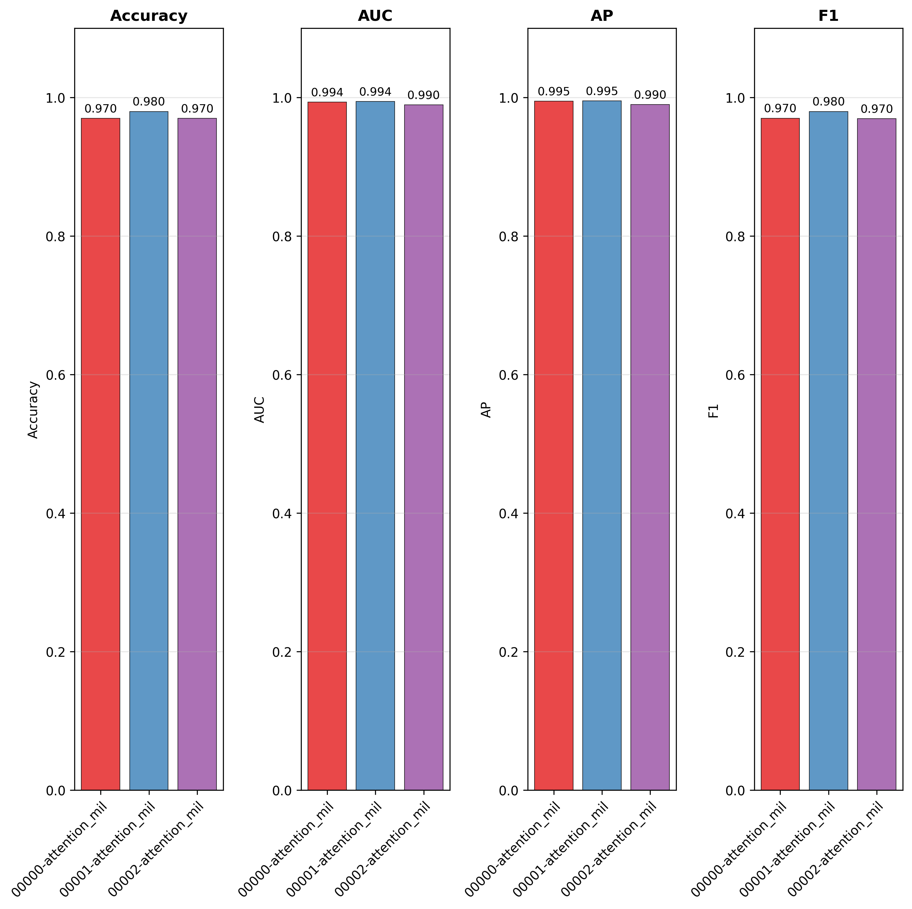

# Quickstart

This guide walks you through a minimal, end-to-end AutoMIL workflow: from preparing your data to running a first model evaluation. It is intended to provide a high-level overview of the typical AutoMIL pipeline.

??? info "Dataset Infos"

	For the purposes of this demonstration, we use an example set of whole-slide images from [The Cancer Genome Atlas Program (TCGA)](https://www.cancer.gov/ccg/research/genome-sequencing/tcga) consisting of lung tissue samples. This dataset can be downloaded via [slideflows project module](https://slideflow.dev/project/#slideflow.Project), which provides the slides in the form of a preconfigured project named `LungAdenoSquam`. Since the indiviual image files are quite large and the full project contains 941 slides, we restrict this example to a randomly sampled subset of 100 slides. The subset can be replicated using this [annotation file](../assets/lung_labels.csv). Provide this file to slideflows API to make sure only the annotated slides are downloaded:

	```python
		#!/usr/bin/env python3
		import slideflow as sf
		from slideflow.project_utils import LungAdenoSquam

		if __name__ == "__main__":

			project = sf.create_project(
				root='LungAdenoSquam',
				cfg=LungAdenoSquam().__dict__,
				annotations="path/to/lung_labels.csv",
				download=True
			)
	```

---

## (Optional) 1. Activate Your Environment

If you installed AutoMIL in a virtual environment, ensure your venv is activated before running AutoMIL.

```bash
source .venv/bin/activate
```

---

## 2. Prepare the Dataset

AutoMIL expects your WSI dataset to consist of slide images in one of many supported formats (.tiff, .svs, .tif etc) and a file containing slide-level label information 

A minimal dataset consists of:

- A directory containing slide images
- A .csv metadata file with slide-level annotations

Example directory structure:

```text
./LungAdenoSquam/
├── slides/
	├── TCGA-05-4430-01Z-00-DX1.95659bbb-3091-4370-bc1d-6c6c1baa7b3d.svs
	├── TCGA-55-A48Z-01Z-00-DX1.0867DC6A-2A51-4CF1-AE3F-0526CE2DD740.svs
	├── TCGA-55-A4DG-01Z-00-DX1.9CE9B7BE-48EF-44F1-9C25-F15700A3E5DE.svs
	└── ...
└── lung_labels.csv
```

With annotations.csv:

```csv
patient,subtype,site,slide
TCGA-05-4430,adenocarcinoma,Site-61,TCGA-05-4430-01Z-00-DX1.95659bbb-3091-4370-bc1d-6c6c1baa7b3d
TCGA-55-A48Z,adenocarcinoma,Site-67,TCGA-55-A48Z-01Z-00-DX1.0867DC6A-2A51-4CF1-AE3F-0526CE2DD740
TCGA-55-A4DG,adenocarcinoma,Site-67,TCGA-55-A4DG-01Z-00-DX1.9CE9B7BE-48EF-44F1-9C25-F15700A3E5DE
```

## 3. Run the basic training pipeline

To train a basic [Attention_MIL](https://arxiv.org/abs/1802.04712) model on the dataset, run the `automil train` command with default parameters:

```bash
automil train ./LungAdenoSquam/slides ./LungAdenoSquam/lung_labels.csv results -v -lc "subtype" -sc "slide"
```

AutoMIL expects the column containing labels to be named `label` and the slide names to be identical to the patient identifiers in the `patient` column. Using the `-lc | --label-colum` option, the label column name can be overriden and using the `-sc | --slide-column` option, a specific column containing slide identifiers can be provided

Using the verbose flag `-v`, automil will display additional information messages, giving an overview of the pipelines progress:

```text
INFO     Executing command:                                          
		/data/jonas/Master/AutoMIL/.venv/bin/automil train          
		./Datasets/LungAdenoSquam/slides                            
		./Datasets/LungAdenoSquam/annotations_balanced.csv results  
		-v -lc subtype -sc slide                                    
INFO     Using resolution presets: ['Low']                           
INFO     Using model type: Attention_MIL                             
INFO     Using default image backend cucim                           
INFO     Project directory results already exists                    
INFO     Annotations saved to results/annotations.csv                
INFO     Project scaffold setup complete                             
INFO     Loading existing project at results                         
INFO     Project Summary                                             
INFO     ┌──────────────────────┬─────────────────────────────────────────────────┐                                              
		│Project Directory:    │ results                            			 │                                                           
		│Slide Directory:      │ Datasets/LungAdenoSquam/slides     			 │                                                           
		│Annotations File:     │ Datasets/LungAdenoSquam/annotations_balanced.csv│           
		│Patient Column:       │ patient                             			 │                                                           
		│Label Column:         │ subtype                            			 │                                                           
		│Slide Column:         │ slide                                           │                                                           
		│Transform Labels:     │ False                              			 │                                                           
		│Modified Annotations: │ results/annotations.csv            			 │                                                           
		│Slideflow Project:    │ Loaded                             			 │                                                           
		└──────────────────────┴─────────────────────────────────────────────────┘                                              
																	
INFO     Setting up dataset for resolution preset: Low               
INFO     Computed average MPP across slides: 0.260                   
INFO     Dataset Summary                                             
INFO     ┌──────────────────┬─────────┐                              
		│Resolution Preset │ Low     │                              
		│Tile Size (px)    │ 1000px  │                              
		│Magnification     │ 10x     │                              
		│Microns-Per-Pixel │ 0.260   │                              
		│Tile Size (µm)    │ 260.00µm│                              
		│Pretiled Input    │ False   │                              
		│TIFF Conversion   │ False   │                              
		└──────────────────┴─────────┘                              
																	
INFO     Preparing dataset source at resolution Low (1000px,         
		260.00um) 
```

If not already done, tile extraction and feature bag generation will commence, and the resulting data will be stored `results/tfrecords` and ``results/bags` respectively

```text
[16:24:01] INFO     Finished tile extraction for TCGA-85-8664 (1605 tiles of    
                    1605 possible)                                              
           INFO     No ROI for                                                  
                    TCGA-98-A53J-01Z-00-DX1.EEC6256E-D331-4731-B00C-08622C725F61
                    , using whole slide.                                        
[16:27:14] INFO     Finished tile extraction for TCGA-98-A53J (1595 tiles of    
                    1595 possible)                                              
           INFO     No ROI for                                                  
                    TCGA-44-8119-01Z-00-DX1.1EBEBFA7-22DB-4365-9DF8-C4E679C11312
                    , using whole slide.                                        
[16:27:41] INFO     Finished tile extraction for TCGA-44-8119 (211 tiles of 211 
                    possible)                                                   
[16:27:42] INFO     No ROI for                                                  
                    TCGA-21-1071-01Z-00-DX1.a9bba825-1c92-4101-9086-c4d1c91117af
                    , using whole slide.                                        
[16:28:55] INFO     Finished tile extraction for TCGA-21-1071 (674 tiles of 674 
                    possible)                                                   
           INFO     No ROI for                                                  
                    TCGA-21-1075-01Z-00-DX1.937872ae-4d6f-4d7a-b54f-b7e797cb84b0
                    , using whole slide.                                        
[16:29:53] INFO     Finished tile extraction for TCGA-21-1075 (457 tiles of 457 
                    possible)                                                   
           INFO     No ROI for                                                  
                    TCGA-O2-A52V-01Z-00-DX1.561ADDAE-EC55-461A-84B5-535C93E39C56
                    , using whole slide.                                        
[16:36:20] INFO     Finished tile extraction for TCGA-O2-A52V (3460 tiles of    
                    3460 possible) 
```

!!! warning "Tile Extraction Takes Time"

	Depending on the slide size and the amount of tissue that can be tiled, the tile extraction may take some time (see the timestamps in the log above). If possible, consider using a pretiled dataset


Finally, the trained model will be saved in the `results/` directory under `results/models/`.

## 4. Evaluate the trained model

To evaluate the trained model on the same dataset, run the `automil evaluate` command:

```bash
automil evaluate ./LungAdenoSquam/slides ./LungAdenoSquam/lung_labels.csv ./results/bags ./results/models -v -lc "subtype" -sc "slide" -o "./results/evaluation"
```

Once again, the verbose flag provides detailed information on the pipelines progress and current state:

```text
INFO     Evaluation complete.                                        														
INFO     Model Comparison:                                           
INFO                         model  Accuracy  AUC   F1               
		00002-attention_mil-label      0.85 0.94 0.86               
		00001-attention_mil-label      0.90 0.92 0.90               
		00000-attention_mil-label      0.85 0.90 0.84               
INFO     Saved plot 'box_plots' to                                   
		results/evaluation/figures/box_plots.png                    
INFO     Saved plot 'model_comparison' to                            
		results/evaluation/figures/model_comparison.png             
INFO     Saved plot 'per_class_accuracy' to                          
		results/evaluation/figures/per_class_accuracy.png           
INFO     Saved plot 'roc_curves' to                                  
		results/evaluation/figures/roc_curves.png   
```

This will create an evaluation report inside the `./results/evaluation` directory, containing metrics and plots of the model performance:




